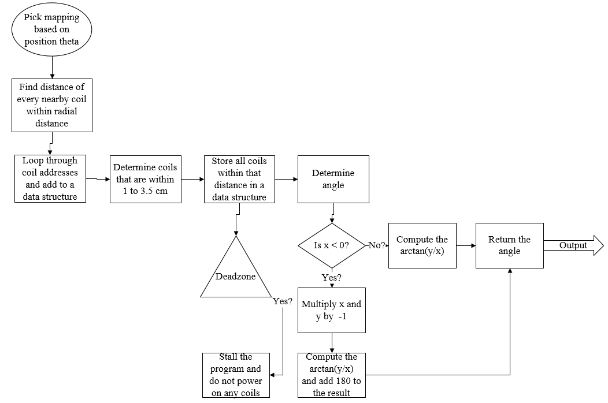
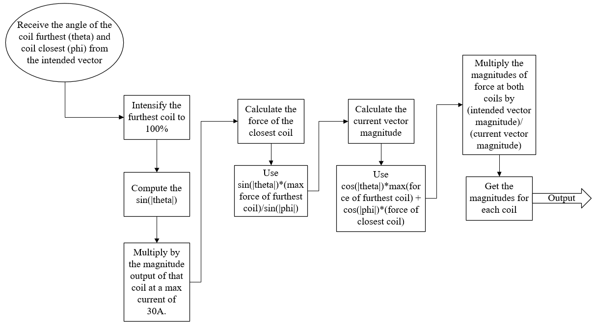

# Omnibot 2018-19 Senior Design Project - University of Akron

### Hardware Specifications

### Software Specification
##### Below are the diagrams for software

-   Attributed to the OmnibotVector class:

-   Attributed to the OmnibotCoilIntensity class:
